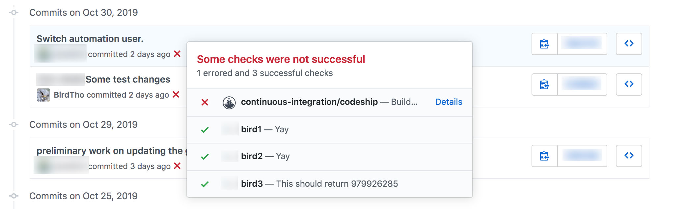

# grunt-github-update-status v0.0.2

> Send build status from your CI pipeline or automated tools through the GitHub API to individual commit refs on github.com


(You want this)

Readme formatting borrowed shamelessly from grunt-contrib-copy

## Getting Started

If you haven't used [Grunt](http://gruntjs.com/) before, be sure to check out the [Getting Started](http://gruntjs.com/getting-started) guide, as it explains how to create a [Gruntfile](http://gruntjs.com/sample-gruntfile) as well as install and use Grunt plugins. Once you're familiar with that process, you may install this plugin with this command:

```shell
npm install grunt-github-update-status --save-dev
```

Once the plugin has been installed, it may be enabled inside your Gruntfile with this line of JavaScript:

```js
grunt.loadNpmTasks('grunt-github-update-status');
```

*This plugin was designed to work with Grunt 0.4.x. If you're still using grunt v0.3.x it's strongly recommended that [you upgrade](http://gruntjs.com/upgrading-from-0.3-to-0.4), but in case you can't please use [v0.3.2](https://github.com/gruntjs/grunt-contrib-copy/tree/grunt-0.3-stable).*

## GitHub Update Status task
_Run this task with the `grunt github-update-status` command._

### Data
Formatting the task configuration for github-status-update follows one of two methods:
```js
module.exports = {
  myTask: {
    status: 'pending',
    targetUrl: 'http://some.place/here/is',
    description: 'This test hasn\'t run yet.',
    context: 'test',
    options: {
      commitSha: '0ccff57f4fab07b1e6da18aa96227cbebd8d2563',
      token: 'MY GITHUB TOKEN IS A SECRET!',
      user: 'BirdTho',
      repo: 'grunt-github-update-status'
    }
  }
}
```

-or-

```js
module.exports = {
  myTask: {
    updates: [
      {
        status: 'success',
        targetUrl: 'https://app.codeship.com/projects/<project id>/builds/<build id>?step=build',
        description: 'The build was completed successfully in 254 seconds!',
        context: 'build',
      },
      {
        status: 'pending',
        targetUrl: 'https://app.codeship.com/projects/<project id>/builds/<build id>?step=test',
        description: 'This test hasn\'t run yet.',
        context: 'test',
      }
    ],
    options: {
      commitSha: '0ccff57f4fab07b1e6da18aa96227cbebd8d2563',
      token: 'MY GITHUB TOKEN IS A SECRET!',
      user: 'BirdTho',
      repo: 'grunt-github-update-status'
    }
  }
}
```

## Arguments
### A Note:
You will notice most of these string components also accept a `Function():string`.
If you want, you can provide a function that returns a string. This makes the task more
flexible as you could synchronously check a file for test output, or check a global variable for elapsed time.
You could even check test pass/fail and then update a status to failure or success depending.

### Single update
See also [GitHub Status API V3 Docs](https://developer.github.com/v3/repos/statuses/) 
for a better description of the following:
#### status
Type: `string | Function():string`

This parameter is mandatory for any status. It is a status of the whole commit's progress or of a named context.
Legal values are `'pending', 'error', 'failure', and 'success'`
#### context
Type: `string | Function():string`

Default: `undefined`

Optional.

This can differentiate statuses based on process or origin of status. Not required.
e.g. "codeship/test" vs "security pro 3000/audit" or just "build" or "test"

#### targetUrl
Type: `string | Function():string`

Default: `undefined`

Optional.

If provided, supplying this targetUrl with a valid URL will make it possible to link back to 
the original site or service that generated the status message. Useful shortcut! 

#### description
Type: `string | Function():string`

Default: `undefined`

Optional.

Useful flavor text for providing details about the status. Options may include % of test coverage, 
build time, or reason for failure 

### Multiple updates
Same as the rules for a single update, but as in the second example above, multiple 
updates are encapsulated as objects in an array like so:

Because remember, you can have multiple contexts for 
a single commit ref through rhe GitHub API.
```javascript
updates: [
  {
    status: 'pending',
    targetUrl: function () {
      return 'https://app.codeship.com/projects/' +
        process.env.CI_PROJECT_ID + '/builds/' +
        process.env.CI_BUILD_ID + '?step=test';
    },
    description: 'The testinating is about to commence.',
    context: 'tests'
  },
  {
    ...another status, description, 
       targetUrl, context here...
  },
  {...}
]
```

### Options
#### token
Type: `string` `Function():string`

Default: `process.env.GITHUB_TOKEN`

Totally required.

This is passed to the instance of NPM github-api in order to connect to your GitHub account
You will likely want to set up a GitHub token with repo permissions, especially `repo:status`

If it is not provided, this task will automatically check yor environment variables for `GITHUB_TOKEN`

See [Creating a Personal Access Token](https://help.github.com/en/github/authenticating-to-github/creating-a-personal-access-token-for-the-command-line) in GitHub help docs


#### commitSha
Type: `string` `Function():string`

Default: Whatever `git rev-parse HEAD` returns. I would assume the task is running against the same commit 

#### user
Type: `string` `Function():string`
  
Default: `undefined`

Required.

Surely there may be a way to suss it out from the Git CLI by parsing the
upstream origin endpoint. But you can do that. For this repo, the user would be `BirdTho`, just as the path to this repo is
```text
https://github.com/BirdTho/grunt-github-update-status`
https://github.com/<user>/<repo>
``` 

#### repo
Type: `string` or `Function():string`  
Default: `undefined`

Required.

Same as `user` above, except the name of the repository. Look at the above github user/repo example.

---
Task submitted by [Christopher Thomas](https://github.com/BirdTho)

### History:
- 0.0.1 It was releaseded!
- 0.0.2 Grunt tasks need to go in the tasks/ subfolder, supposedly!